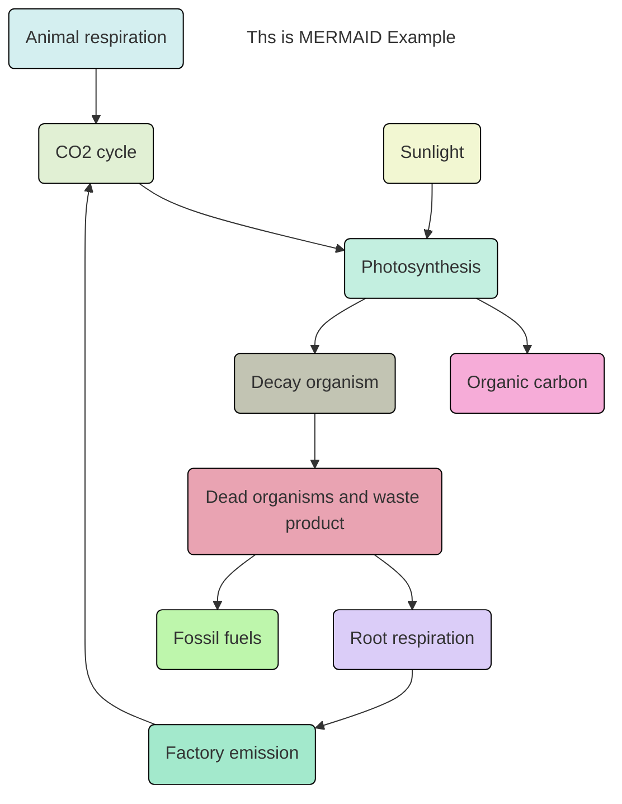

[Reference](https://gist.github.com/ihoneymon/652be052a0727ad59601)
일부 내용 추가,수정함
-----
본문이 길어지면 목차를 생성할수 있습니다.

# 목차- 마크다운 사용법(문법)
1. [헤더](#21-헤더Headers)
2. [줄바꿈](#22-줄바꿈)
3. [BlockQuote](#23-BlockQuote)
4. [목록](#24-목록)
5. [코드](#25-코드)
6. [수평선](#26-수평선-hr)
7. [링크](#27-링크)
8. [강조](#28-강조)
9. [이미지](#29-이미지)
10. [표그리기](#210-표그리기)
11. [Mermaid Chart 그려넣기](#211-Mermaid-Chart-그려넣기)
12. [SVG그려넣기](#212-SVG-그려넣기)
-----
# 1. 마크다운에 관하여
## 1.1. 마크다운이란?
[**Markdown**](https://www.markdownguide.org/getting-started/)은 텍스트 기반의 마크업언어로 2004년 존그루버에 의해 만들어졌으며 쉽게 쓰고 읽을 수 있으며 HTML로 변환이 가능하다. 특수기호와 문자를 이용한 매우 간단한 구조의 문법을 사용하여 웹에서도 보다 빠르게 컨텐츠를 작성하고 보다 직관적으로 인식할 수 있다.
마크다운이 최근 각광받기 시작한 이유는 깃헙([https://github.com](https://github.com)) 덕분이다. 깃헙의 저장소Repository에 관한 정보를 기록하는 README.md는 깃헙을 사용하는 사람이라면 누구나 가장 먼저 접하게 되는 마크다운 문서였다. 마크다운을 통해서 설치방법, 소스코드 설명, 이슈 등을 간단하게 기록하고 가독성을 높일 수 있다는 강점이 부각되면서 점점 여러 곳으로 퍼져가게 된다.

## 1.2. 마크다운의 장-단점
### 1.2.1. 장점
	1. 간결하다.
	2. 별도의 도구없이 작성가능하다.
	3. 다양한 형태로 변환이 가능하다.
	4. 텍스트(Text)로 저장되기 때문에 용량이 적어 보관이 용이하다.
	5. 텍스트파일이기 때문에 버전관리시스템을 이용하여 변경이력을 관리할 수 있다.
	6. 지원하는 프로그램과 플랫폼이 다양하다.

### 1.2.2. 단점
	1. 표준이 없다.
	2. 표준이 없기 때문에 도구에 따라서 변환방식이나 생성물이 다르다.
	3. 모든 HTML 마크업을 대신하지 못한다.

****
# 2. 마크다운 사용법(문법)
## 2.1. 헤더Headers
* 큰제목: 문서 제목
    ```
    This is an H1
    =============
    ```
    This is an H1
    =============

* 작은제목: 문서 부제목
    ```
    This is an H2
    -------------
    ```
    This is an H2
    -------------

* 글머리: 1~6까지만 지원
```
# This is a H1
## This is a H2
### This is a H3
#### This is a H4
##### This is a H5
###### This is a H6
```
# This is a H1
## This is a H2
### This is a H3
#### This is a H4
##### This is a H5
###### This is a H6
####### This is a H7(지원하지 않음)

## 2.2. 줄바꿈
3칸 이상 띄어쓰기(` `)를 하면 줄이 바뀐다.

```
* 줄 바꿈을 하기 위해서는 문장 마지막에서 3칸이상을 띄어쓰기해야 한다. 
이렇게

* 줄 바꿈을 하기 위해서는 문장 마지막에서 3칸이상을 띄어쓰기해야 한다.___\\ 띄어쓰기
이렇게
```

* 줄 바꿈을 하기 위해서는 문장 마지막에서 3칸이상을 띄어쓰기해야 한다. 이렇게

* 줄 바꿈을 하기 위해서는 문장 마지막에서 3칸이상을 띄어쓰기해야 한다.    \
이렇게

## 2.3. BlockQuote
이메일에서 사용하는 ```>``` 블럭인용문자를 이용한다.
```
> This is a first blockqute.
>> This is a second blockqute.
>>> This is a third blockqute.
```
> This is a first blockqute.
>> This is a second blockqute.
>>> This is a third blockqute.

이 안에서는 다른 마크다운 요소를 포함할 수 있다.
> ### This is a H3
> * List
>	```
>	code
>	```

## 2.4. 목록
### ● 순서있는 목록(번호)
순서있는 목록은 숫자와 점을 사용한다.
```
1. 첫번째
2. 두번째
3. 세번째
```
1. 첫번째
2. 두번째
3. 세번째

**현재까지는 어떤 번호를 입력해도 순서는 내림차순으로 정의된다.**
```
1. 첫번째
3. 세번째
2. 두번째
```
1. 첫번째
3. 세번째
2. 두번째

딱히 개선될 것 같지는 않다. 존 그루버가 신경안쓰고 있다고...

### ● 순서없는 목록(글머리 기호: `*`, `+`, `-` 지원)
```
* 빨강
  * 녹색
    * 파랑

+ 빨강
  + 녹색
    + 파랑

- 빨강
  - 녹색
    - 파랑
```
* 빨강
  * 녹색
    * 파랑

+ 빨강
  + 녹색
    + 파랑

- 빨강
  - 녹색
    - 파랑

혼합해서 사용하는 것도 가능하다(내가 선호하는 방식)

```
* 1단계
  - 2단계
    + 3단계
      + 4단계
```

* 1단계
  - 2단계
    + 3단계
      + 4단계

## 2.5. 코드
4개의 공백 또는 하나의 탭으로 들여쓰기를 만나면 변환되기 시작하여 들여쓰지 않은 행을 만날때까지 변환이 계속된다.

### 2.5.1. 들여쓰기
```
This is a normal paragraph:

    This is a code block.
    
end code block.
```

실제로 적용해보면,

적용예:

*****
This is a normal paragraph:

    This is a code block.

end code block.
*****

> 한줄 띄어쓰지 않으면 인식이 제대로 안되는 문제가 발생합니다.

```
This is a normal paragraph:
    This is a code block.
end code block.
```

적용예:

*****
This is a normal paragraph:
    This is a code block.
end code block.
*****

### 2.5.1. 코드블럭
코드블럭은 다음과 같이 2가지 방식을 사용할 수 있습니다:

* `<pre><code>{code}</code></pre>` 이용방식

```
<pre>
<code>
public class BootSpringBootApplication {
  public static void main(String[] args) {
    System.out.println("Hello, Honeymon");
  }

}
</code>
</pre>
```

<pre>
<code>
public class BootSpringBootApplication {
  public static void main(String[] args) {
    System.out.println("Hello, Honeymon");
  }
}
</code>
</pre>

* 코드블럭코드("\```") 을 이용하는 방법

<pre>
<code>
```
public class BootSpringBootApplication {
  public static void main(String[] args) {
    System.out.println("Hello, Honeymon");
  }
}
```
</code>
</pre>

```
public class BootSpringBootApplication {
  public static void main(String[] args) {
    System.out.println("Hello, Honeymon");
  }
}
```

**깃헙**에서는 코드블럭코드("\```") 시작점에 사용하는 언어를 선언하여 [문법강조(Syntax highlighting)](https://docs.github.com/en/github/writing-on-github/creating-and-highlighting-code-blocks#syntax-highlighting)이 가능하다.

<pre>
<code>
```java
public class BootSpringBootApplication {
  public static void main(String[] args) {
    System.out.println("Hello, Honeymon");
  }
}
```
</code>
</pre>

```java
public class BootSpringBootApplication {
  public static void main(String[] args) {
    System.out.println("Hello, Honeymon");
  }
}
```


## 2.6. 수평선 ```<hr/>```
아래 줄은 모두 수평선을 만든다. 마크다운 문서를 미리보기로 출력할 때 *페이지 나누기* 용도로 많이 사용한다.

```
* * *

***

*****

- - -

---------------------------------------
```

* 적용예
* * *

***

*****

- - -

---------------------------------------


## 2.7. 링크
* 참조링크

```
[link keyword][id]

[id]: URL "Optional Title here"

// code
Link: [Google][googlelink]

[googlelink]: https://google.com "Go google"
```

Link: [Google][googlelink]

[googlelink]: https://google.com "Go google"

* 외부링크
```
사용문법: [Title](link)
적용예: [Google](https://google.com, "google link")
```
Link: [Google](https://google.com, "google link")

* 자동연결
```
일반적인 URL 혹은 이메일주소인 경우 적절한 형식으로 링크를 형성한다.

* 외부링크: <http://example.com/>
* 이메일링크: <address@example.com>
```

* 외부링크: <http://example.com/>
* 이메일링크: <address@example.com>

## 2.8. 강조
```
*single asterisks*
_single underscores_
**double asterisks**
__double underscores__
~~cancelline~~
```

* *single asterisks*
* _single underscores_
* **double asterisks**
* __double underscores__
* ~~cancelline~~

> ```문장 중간에 사용할 경우에는 **띄어쓰기** 를 사용하는 것이 좋다.```   
> 문장 중간에 사용할 경우에는 띄어쓰기를 사용하는 것이 좋다.


## 2.9. 이미지
```


```


사이즈 조절 기능은 없기 때문에 ```</img>```를 이용한다.

예
```
</img><br/>
</img>
```

</img><br/>
</img>


## 2.10. 표그리기

```
* 표를 그리기 위해서 도구에 따라 한 줄을 공백으로 띄워야 표가 정상적으로 표시된다.  
표의 셀 안에 여러줄을 쓰기 위해 줄바꿈은 <br>을 사용한다.  
셀 안의 align은 |:--| 왼쪽맞춤, |:--:| 또는 |--| 가운데 맟줌, |--:| 오른쪽 맟춤으로 설정한다.  

| 제목1 | 제목2 | 제목 3 |
|:--|:--:|--:|
|내용1|내용2|내용3|
|내용4|내용5|내용6<br>내용7|

```

| 제목1입니다 | 제목2 | 제목3입니다 |
|:--|:--:|--:|
| 내용1|내용2|내용3|
|내용4|내용5|내용6<br>내용7|


## 2.11. Mermaid Chart 그려넣기
https://mermaidchart.com 에 접속하여 Google계정으로 가입하여 -> Create New로 새 chart생성(3개 까지 무료생성)   
White Board 를 열어서 Template 중에서 가장 가까운 모델을 선택하고 Whiteboard 모드를 끄면 좌측에 mermaid script가 나타난다. 이를 mermaid tag로 감싸서 붙여넣으면 md 파일에 diagram이 생성된다.  
### Example :


## 2.12. SVG 그려넣기

SVG 파일은 벡터데이터이미지로 다음과 같이 markdown파일에 첨부가 가능합니다.  
- 이미지와 같은 형식으로 첨부
```

```


- 직접 인라인으로 svg파일을 삽입 (HTML을 지원하는 마크다운 렌더러에서만 동작함)
```
<svg width="100" height="100" xmlns="http://www.w3.org/2000/svg">
  <circle cx="50" r="40" stroke="green" stroke-widh="4" fill="yellow" />
</svg>
```


<svg width="100" height="100" xmlns="http://www.w3.org/2000/svg">
  <circle cx="50" r="40" stroke="green" stroke-widh="4" fill="yellow"/>
</svg>


<svg width="800px" height="800px" viewBox="0 0 512 512" xmlns="http://www.w3.org/2000/svg"><path fill="#0084ff" d="M512 0H0v512h512z"/><path d="M257 93c-88.918 0-161 67.157-161 150 0 47.205 23.412 89.311 60 116.807V417l54.819-30.273C225.449 390.801 240.948 393 257 393c88.918 0 161-67.157 161-150S345.918 93 257 93zm16 202l-41-44-80 44 88-94 42 44 79-44-88 94z" fill="#ffffff"/></svg>


