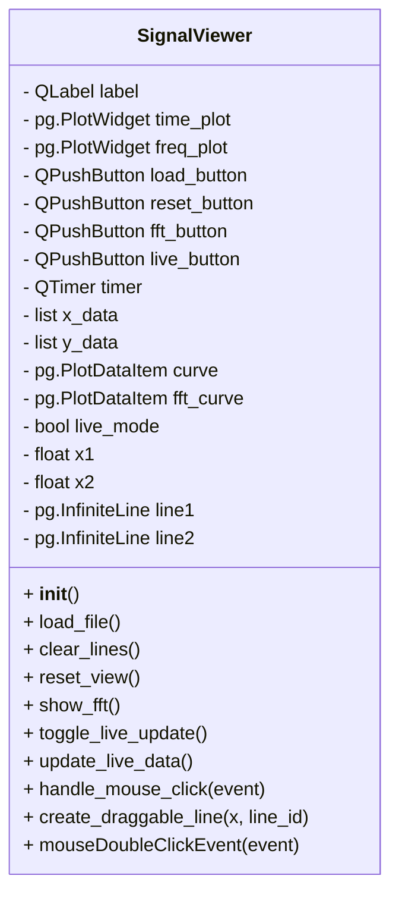

# 📦 PyQt6 + pyqtgraph 기반 신호 뷰어 (실시간 update + FFT 주파수 분석지원)

이 코드를 실행하면 example_signal.txt를 불러올 수 있는 시각화 앱이 실행되고, 마우스를 통해 줌, 이동, 리셋 뷰를 쉽게 사용할 수 있습니다.  

🧠 전체 구조
- PlotWidget 2개 사용: 하나는 시간 영역, 하나는 주파수 영역
- QTimer로 실시간 업데이트 구현
- numpy.fft로 FFT 계산
- time domain diagram에서 x1 ,x2 선택하여 zoom기능 지원

# Signal Viewer Application

This application is a PyQt6-based GUI for visualizing signals in both the time and frequency domains. It supports loading signal files, performing FFT analysis, and live signal updates.

## Application Structure

## API Description

### `__init__()`
Initializes the `SignalViewer` class, setting up the GUI layout, widgets, and connections.

### `load_file()`
Opens a file dialog to load a signal file (CSV format). Updates the time-domain plot with the loaded data.

### `clear_lines()`
Clears any vertical lines added to the time-domain plot.

### `reset_view()`
Resets the time-domain plot to its original view and clears any vertical lines.

### `show_fft()`
Performs a Fast Fourier Transform (FFT) on the loaded signal data and updates the frequency-domain plot.

### `toggle_live_update()`
Toggles live signal updates. Starts or stops a timer to generate and display live signal data.

### `update_live_data()`
Generates and appends new signal data for live updates. Updates the time-domain plot with the latest data.

### `handle_mouse_click(event)`
Handles mouse click events on the time-domain plot. Adds draggable vertical lines for marking regions of interest.

### `create_draggable_line(x, line_id)`
Creates a draggable vertical line at the specified x-coordinate. Updates the corresponding line position when moved.

### `mouseDoubleClickEvent(event)`
Handles double-click events on the time-domain plot. Zooms into the region between two vertical lines if applicable.